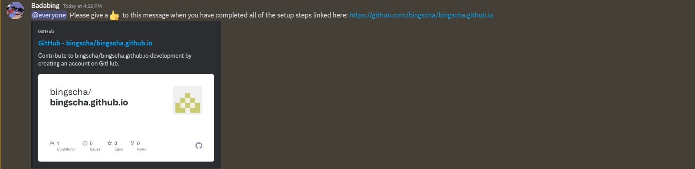
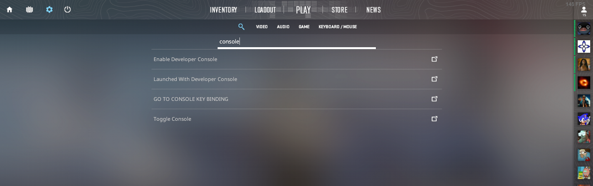
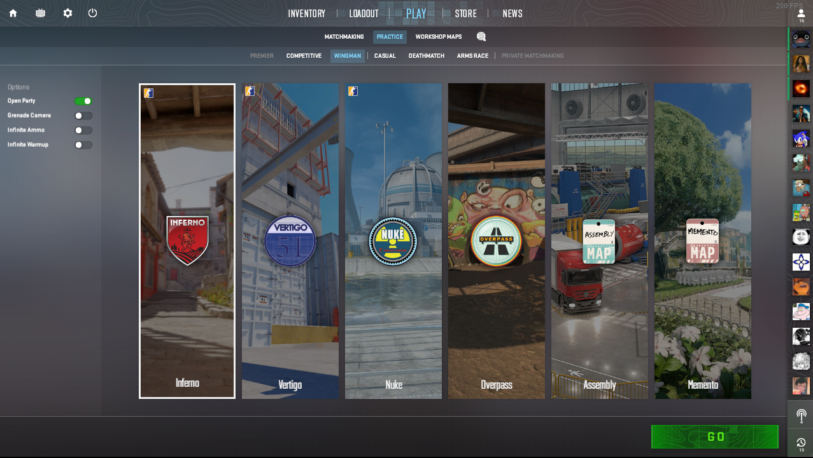

# eBOG Setup Guide
Below is a setup guide for all the games that we will be playing. Please follow all steps and double check if you have everything properly set up if you have done this before. When done **give a thumbs up to the message in Discord**. If there are any questions or issues please message DaLi or Bing, and we can help get you sorted.

## Installations Steps
1. [Install Discord](#discord)
2. [Install CS 2](#cs)
3. [Install Fall Guys](#fall-guys)
4. [Setup tetr.io](#tetris)

<h3 id="discord">Installing Discord</h3>

Feel free to skip to step 3 if you have already setup a Discord account.

1. Download Discord from https://discord.com/download
a. If you do not want to download the desktop app, feel free to use the browser site as well, found here: https://discord.com/app
2. Setup a Discord account.
3. Use the Discord link in the eBOG Messenger Channel to join our Discord channel.
4. Test to make sure that you can properly speak and hear other people.

<h3 id="cs">Installing CS 2</h3>

If you have already installed Counter Strike 2 in the past, please make sure it is up to date by opening the Steam Launcher. The game mode that we will be playing during the event is **Wingman**.

1. Install the Steam launcher from https://store.steampowered.com/about/?l=english if you have not done so already.
2. Create a Steam account if you have not done so already.
3. Install Counter-Strike 2. The game is about 43 GB.
4. Open CS 2. **Beware:** The opening scene might be a little loud.
5. In the settings menu, search for the phrase "console" and select "Enable Developer Console". Ensure that it is turned on.

6. Test opening the console with the "~" key on your keyboard.
7. I recommend attempting to play with bots at least once before the event to get an idea of the game. The game mode we will be playing is called "Wingman". A screenshot belows shows how you can setup a practice game.

8. If you want to learn the game a bit more feel free to look up stuff on Youtube but do not panic. You WILL be on a team with someone else who has played the game before (just hope its not Frank).

<h3 id="fall-guys">Installing Fall Guys</h3>

If you have already installed Fall Guys in the past, please make sure it is up to date by opening the Epic Games Launcher.

1. Install the Epic Games launcher from https://store.epicgames.com/en-US/download if you have not done so already.
2. This may require you to create an Epic Games account as well. I recommend signing in through another account like Google, Xbox, or Steam.
3. Install Fall Guys, the game is Free to Play so there should be no cost. The game is about 2 GB.
4. If you haven't played before, launch the game and make sure everything works. Try a game or two to become somewhat familiar with the controls.

If you own another device that can play Fall Guys, feel free to install and play from those devices instead. The game is available on Switch (although it has pretty poor performance), Playstation, and Xbox. If you do choose to play on one of those device make sure that you can play and be on Discord at the same time.

<h3 id="tetris">Setting Up tetri.io</h3>

Nothing much to set up here. Just go to [tetr.io](https://tetr.io/) and learn the controls of the game. It's all on browser. We will be playing Battle Royale mode. I highly recommend changing the sound settings to make it easier to listen to others via Discord. 

**Again, once you have installed all of the necessary software, please like the post in the Discord. To the best Bogger goes the spoils.**
